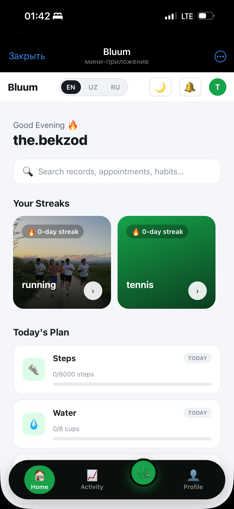
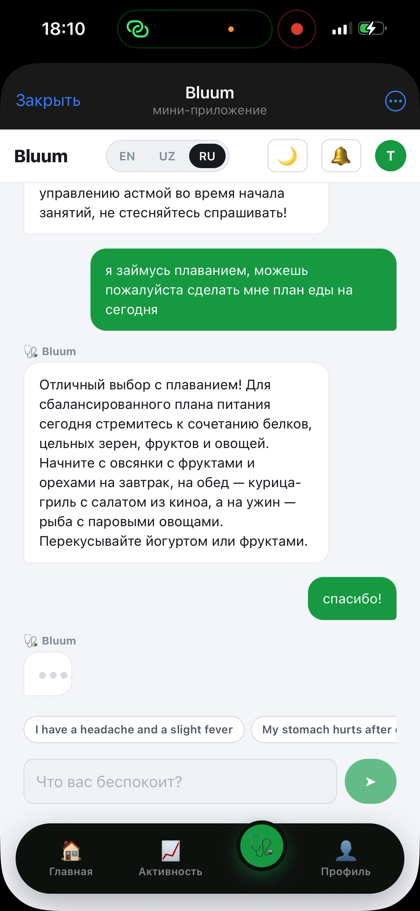
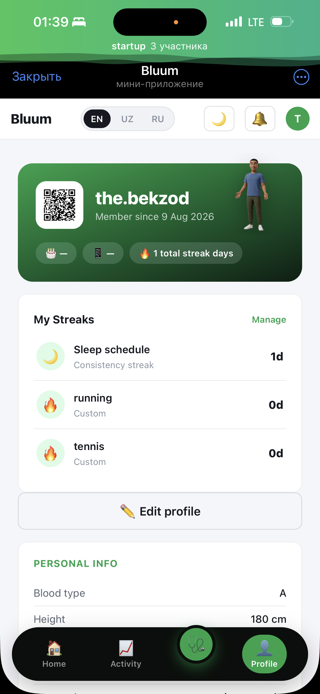

<p align="center">
  
</p>

<h3 align="center">Habit-streak & wellness, native to the app 25M+ Uzbeks already have open.</h3>

<p align="center">
  <a href="https://t.me/bluumapp_bot">🤖 Try it — open in Telegram</a> ·
  <a href="#roadmap">Roadmap</a> ·
  <a href="#team">Team</a> ·
  <a href="#developer-setup">Developer setup</a>
</p>

<p align="center">Submitted for the <b>President Tech Award 2026</b>.</p>

---

## What Bluum is

Bluum turns quitting a habit, fixing your sleep, and understanding your health into a daily
streak worth showing up for — built **Telegram-native**, so there's no app to install, and
powered by an **AI coach that already knows your context** instead of starting from zero every
conversation.

### The problem

Staying healthy has always felt like an obligation — something you're told to do, not something
you want to do. Willpower alone doesn't hold up past week two without daily accountability, and
nothing on the market is actually built for how people here live: global habit apps aren't
localized for Uzbek/Russian speakers, and hardware trackers like Oura or Whoop cost $300+ —
completely out of reach for most people in the region.

### The solution

- **Real accountability** — visible streaks and shareable progress, built to keep a promise to
  yourself, not just log data nobody looks at again.
- **Telegram-native, free to start** — no app-store friction, no separate account, no hardware
  required. Open the chat you already use.
- **An AI that has context** — "Ask Bluum" already knows your habits, streaks, sleep, and recent
  activity, so every answer is personal instead of generic advice copied from a search result.

---

## Screenshots

| Home dashboard | Ask Bluum | Profile & streaks |
|---|---|---|
|  |  |  |

---

## Key features

- **Habit streaks** — track daily habits like sleep, hydration, movement, or quitting something;
  streaks grow automatically from check-ins, with gentle nudges before one breaks.
- **Ask Bluum** — a built-in AI chat with real context (your active habits and streak lengths,
  last night's sleep, today's logged activity, recent medications/results) instead of generic
  Q&A.
- **Sleep tracking** — daily sleep-time/wake-time logging with its own streak.
- **Nutrition logging** — photo-based food logging with calorie/macro estimates (currently
  simulated pending a real vision-model integration — see [Known limitations](#known-limitations)).
- **Proactive Telegram reminders** — an evening check-in nudge and a weekly recap, sent as native
  Telegram messages with one-tap inline check-in buttons — fully **opt-in**, off by default for
  every patient.
- **EN / UZ / RU + dark mode** — full language support and a dark theme, designed around how
  people in Central Asia actually use their phones.
- **Free / Premium / Corporate (B2B2C) tiers** — a working free product from day one, with a
  premium AI-insights tier and a corporate/university seat model for later.
- **Legacy patient-record module** — Bluum began as a hospital-facing patient-intelligence
  platform (QR check-in, doctor-approved visit summaries, prescriptions, staff dashboard). That
  code still lives here (`/staff`, `/hospital/...`, `/patients/<token>/records`, etc.) and still
  works, and it's what powers the extra context "Ask Bluum" pulls from — but the current product
  focus, and this submission's vision, is the Telegram habit-streak platform described above.

---

## Roadmap

Foundation stays software-first and free. From there, the plan narrows toward a specific,
underserved niche — university students during exam season — rather than competing broadly with
general fitness trackers on day one:

1. **Organic Foundation** *(now–2mo)* — organic growth via streak-sharing, campus ambassadors,
   and award PR.
2. **Focus Wearable R&D** *(2–4mo)* — research and design a low-cost wearable that tracks
   students' focused states, recovery (HRV), and other body data.
3. **Pilot Testing** *(4–5mo)* — validate the prototype with real students through a live exam
   season before committing to manufacturing.
4. **Manufacturing & Supply** *(5–7mo)* — lock in manufacturing partners and a supply chain to
   produce the wearable at scale.
5. **Hardware Launch & Scale** *(7–10mo)* — ship, then scale to a broader audience and new
   regions.

The wearable direction is a **post-funding exploration**, not a change to what's built or being
asked for today — see the "Next Wedge" section of the pitch deck for the full reasoning
(attention-span research, HRV as a wrist-measurable signal, and why a narrow beachhead beats
competing with Oura/Whoop head-on).

---

## Team

| | | |
|---|---|---|
| **Burhoniddinov Bobur** — AI Engineer, Founder | **Fayzullaxo'jayev Izzatkhon** — Financial Expert, Co-Founder | **Niyozov Bekzodbek** — Software Engineer, Co-Founder |
| Purdue University, El-Yurt Umidi scholar | Prague University of Economics and Business | University of Bristol, El-Yurt Umidi scholar |

| **Abduazizov Abror** — Product & Hardware Engineer, Co-Founder |
|---|
| New Uzbekistan University |

---

## Developer setup

### Requirements

- Python 3.10+
- An OpenAI API key (powers Ask Bluum, appointment summaries, and every other AI call)
- A Telegram bot token from [@BotFather](https://t.me/BotFather) (for the Mini App + proactive
  reminders — the rest of the app works fine without it)
- Optionally, an Eskiz.uz account (real SMS delivery for the phone/OTP fallback login — without
  it, `sms.py` no-ops safely and OTP codes are shown on-screen instead)

### Install and run

```bash
cd backend
python3 -m venv .venv && source .venv/bin/activate
pip install -r requirements.txt
cp .env.example .env   # fill in OPENAI_API_KEY, TELEGRAM_BOT_TOKEN, etc.
python app.py
```

Opens on `http://localhost:5001`. Falls back to a local SQLite DB (`backend/instance/bluum.db`)
if `DATABASE_URL` isn't set; uploaded files land in `backend/uploads/`. Both are created
automatically on first run.

### Production deployment

Deployed on [Railway](https://railway.app) via `backend/Procfile`:

```
web: gunicorn -b 0.0.0.0:$PORT --workers 4 --timeout 90 --graceful-timeout 30 --max-requests 1000 --max-requests-jitter 100 app:app
```

Set `FLASK_DEBUG=0`, a real `SECRET_KEY`, `DATABASE_URL` (Postgres), and `PUBLIC_BASE_URL` (used
to auto-register the Telegram webhook on startup) as environment variables on the host. A
misconfigured deployment fails loudly instead of running insecurely — `FLASK_DEBUG=0` also
switches session cookies to HTTPS-only and refuses to start without a real `SECRET_KEY`.

### Environment variables (`backend/.env`)

| Variable | Required | Purpose |
|---|---|---|
| `SECRET_KEY` | In production | Flask session signing. |
| `DATABASE_URL` | No (defaults to local SQLite) | Postgres connection string. The app rewrites `postgres://`/`postgresql://` to `postgresql+pg8000://` automatically — see the comment in `app.py` for why (pg8000 needs no system `libpq`, unlike psycopg2). |
| `OPENAI_API_KEY` | For AI features | Powers every AI call (Ask Bluum, summaries, symptom checker, prep questions, interaction checks). Without it, those forms show a clear in-app error — nothing crashes. |
| `TELEGRAM_BOT_TOKEN` | For the Mini App | Verifies Telegram Mini App logins and sends proactive reminder messages. |
| `PUBLIC_BASE_URL` | For Telegram reminders | Public HTTPS URL of this deployment (e.g. `https://bluum-production.up.railway.app`) — used to auto-register the Telegram webhook at startup. |
| `ESKIZ_EMAIL` / `ESKIZ_PASSWORD` | No | Real SMS delivery for the OTP-login fallback and medication reminders. Without these, `sms.py` logs the message and returns `False` instead of sending. |

`.env` is gitignored — never commit it. `.env.example` documents the full shape for new
contributors.

### Project structure

```
Bluum/
├── README.md
├── bluum.png
└── backend/
    ├── app.py                 # all Flask routes + scheduled jobs
    ├── models.py               # SQLAlchemy models
    ├── prompts.py               # every OpenAI call + prompt template
    ├── telegram_auth.py          # verifies Telegram Mini App initData (HMAC)
    ├── telegram_bot.py            # sends proactive messages / inline-button replies
    ├── auth.py                     # Flask-Login setup for staff accounts
    ├── sms.py                       # Eskiz.uz SMS client (no-ops without credentials)
    ├── nutrition.py                  # food-photo calorie/macro estimation (simulated)
    ├── share_card.py                  # generates the shareable streak-card PNG
    ├── uploads.py                      # file upload helper
    ├── translations.py                  # EN/UZ/RU strings
    ├── migrate_*.py                      # one-time schema migration scripts
    ├── requirements.txt
    ├── .env.example
    ├── static/                            # CSS, fonts, habit/character images
    └── templates/                          # Jinja templates (server-rendered, no JS framework)
```

Patients authenticate either via the **Telegram Mini App** (identity verified through Telegram's
own signed `initData` — no password, no OTP needed) or, as a fallback, via **SMS OTP** (phone
number, no password). Staff authenticate via **email + password**. See the comment in
`inject_notifications()` in `app.py` for why patient and staff sessions are kept intentionally
separate — a single browser can legitimately hold both at once.

---

## Known limitations

- Nutrition/calorie estimates are **simulated** — no real vision-model or wearable integration is
  wired up yet (see the Roadmap above).
- File uploads are stored on local disk, which is ephemeral on most PaaS hosts (Railway
  included) — a wiped filesystem on redeploy will lose previously uploaded files unless a
  persistent volume is attached.
- SMS delivery (`sms.py`) targets Eskiz.uz's commonly documented REST pattern — verify field
  names against your live Eskiz account before relying on it in production.
- No real camera-based QR scanning yet for the legacy staff check-in flow — `/staff` takes a
  manually entered/pasted code.
- EN/UZ/RU covers all in-app page chrome and AI-generated content; a handful of older legacy
  hospital-module pages may not be fully localized.

---

## License

Built for the President Tech Award 2026 by the Bluum team. Contact:
[bbbobur017@gmail.com](mailto:bbbobur017@gmail.com).
